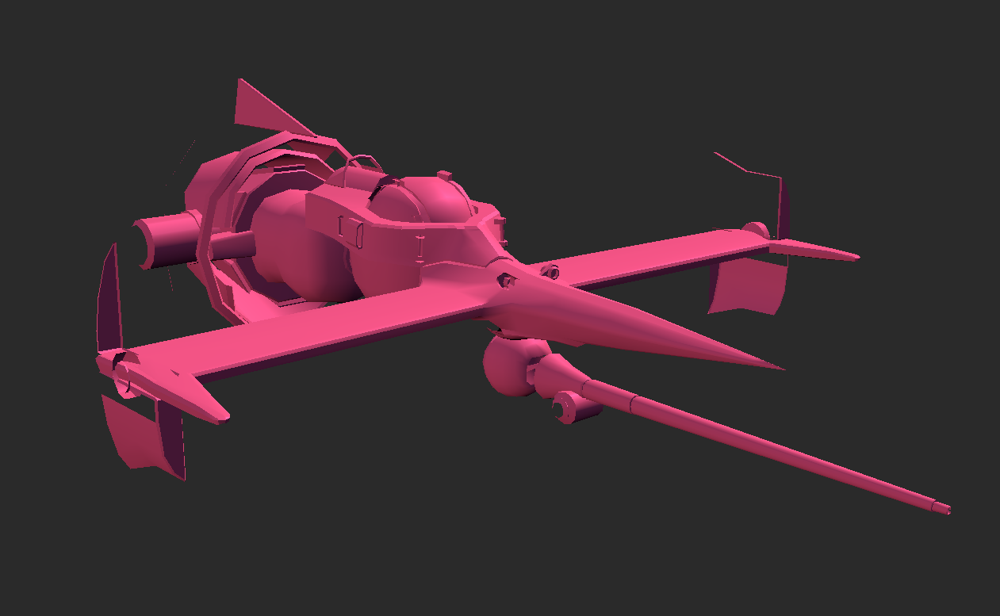
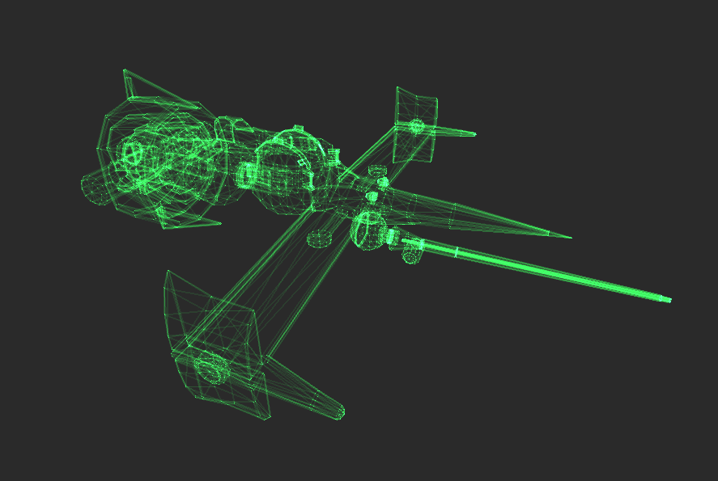
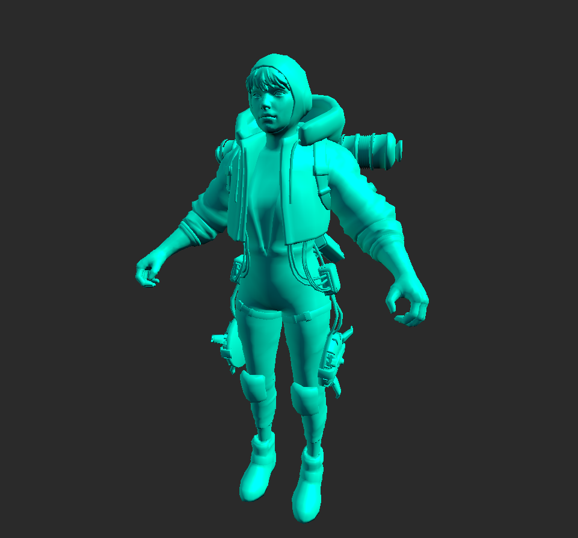
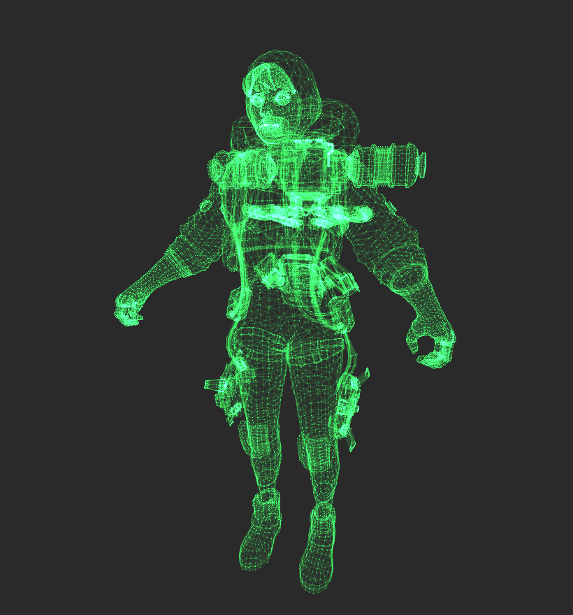
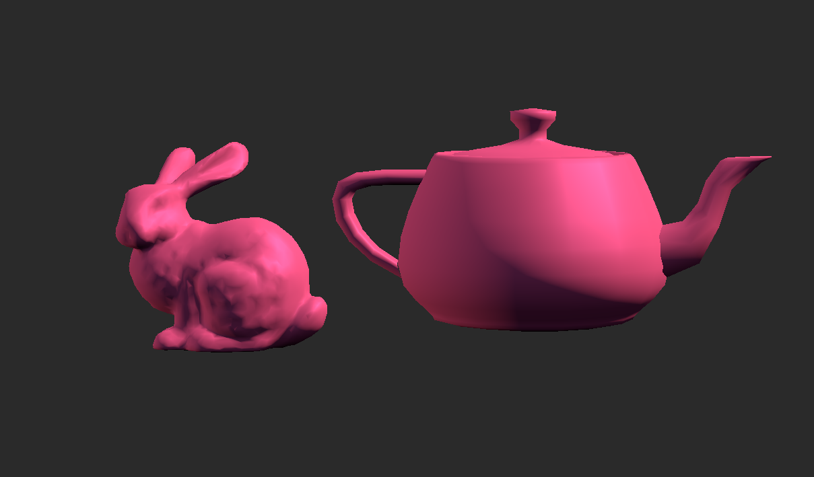
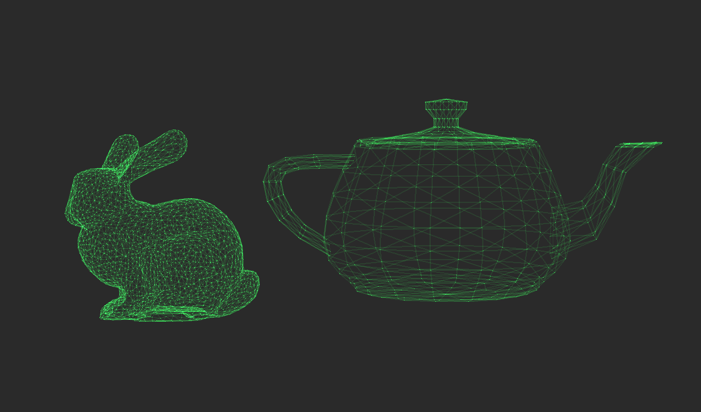

# ISPC 3D Renderer
A simple and tiny software triangle rasterizer written with C/C++ and [Intel's ISPC](https://ispc.github.io/index.html).
I haven't done any major optimizations, it's a toy project just to learn about 3d graphics and ISPC.

The triangle rasterizer is heavily inspired by Fabian "ryg" Giesen's Blog [Triangle rasterization in practice
](https://fgiesen.wordpress.com/2013/02/08/triangle-rasterization-in-practice/) and [Optimizing the basic rasterizer
](https://fgiesen.wordpress.com/2013/02/10/optimizing-the-basic-rasterizer/). Thanks Fabian, you're amazing!

The program renders an image on the CPU, which then gets displayed on a screen with OpenGL.

Depends on [GLFW](https://glfw.org) and [GLAD](https://glad.dav1d.de/) for platform-specific code and OpenGL.

The "driver" code is in [main.cpp](main.cpp) and the actual rendering is in [renderer.ispc](renderer.ispc)

## Features
- Triangle rasterization with SIMD
- Loading OBJ files with [fast_obj](https://github.com/thisistherk/fast_obj)
- Vertex attribute interpolation (depth and normals)
- Simple shading based on [IQ's Outdoors Lighting Article](https://iquilezles.org/articles/outdoorslighting/)
- Display fullscreen texture with OpenGL

## Screenshots

  
  

  
  

  
  

## TODO
Note: I consider this project more-or-less finished. I don't think I'll actually do things from this list, but who knows. I will happily merge any pull requests though.
- Command line arguments
- Loading other model file formats
- Proper triangle clipping
- Better depth encoding
